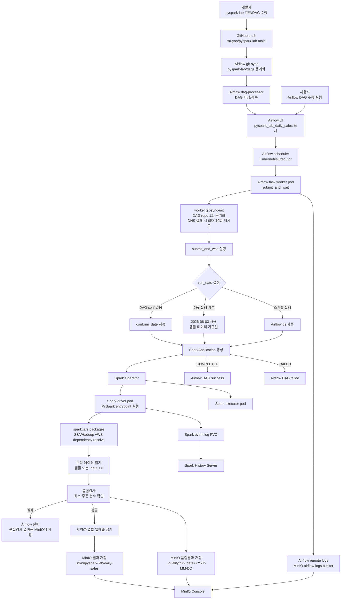

# pyspark-lab

PySpark, Airflow, Spark Operator, MinIO를 한 흐름으로 연습하기 위한 예제 저장소입니다.

## 전체 흐름

```text
개발자
-> pyspark-lab repo push
-> Airflow git-sync가 dags/ 동기화
-> Airflow DAG 수동 실행
-> SparkApplication 생성
-> Spark driver/executor pod 실행
-> 데이터 품질검사와 매출 지표 저장
-> 결과 파일은 MinIO S3 bucket에 저장
-> Spark History Server에서 실행 이력 확인
-> Airflow remote log는 MinIO에 저장
```

## 실행 흐름 도식



이 예제는 작은 주문 데이터를 Spark DataFrame으로 만들고, 일자/지역/채널 단위 매출 지표를 계산합니다. 로컬 테스트에서는 순수 Python 함수로 비즈니스 규칙을 빠르게 검증하고, 클러스터 실행에서는 Airflow DAG가 Spark Operator에 SparkApplication을 제출합니다.

핵심 흐름은 `pyspark-lab repo -> Airflow git-sync -> Spark Operator -> MinIO`입니다. 운영 클러스터 설정과 Secret, PVC, nodeSelector 같은 값은 `oracle-k8s-gitops`에서 관리합니다.

Airflow는 `oracle-k8s-gitops`의 Helm values에 설정된 git-sync로 이 저장소의 `dags/` 디렉터리를 주기적으로 동기화합니다. 새 DAG를 만들 때는 GitOps YAML에 Python 코드를 넣지 않고, 이 저장소의 `dags/`에 파일을 추가한 뒤 `main` branch로 push합니다.

## 주요 파일

- `src/pyspark_lab/config.py`: Airflow가 넘긴 실행 파라미터를 Spark 작업 설정으로 정리
- `src/pyspark_lab/sample_data.py`: 예제 주문 데이터
- `src/pyspark_lab/metrics.py`: Spark 집계와 같은 비즈니스 규칙을 빠르게 검증하는 순수 Python 기준 로직
- `src/pyspark_lab/quality.py`: 지표 저장 전에 실행하는 품질검사 결과 모델
- `jobs/daily_sales_metrics.py`: SparkApplication driver pod에서 실행되는 PySpark entrypoint
- `dags/pyspark_lab_daily_sales.py`: Airflow가 SparkApplication을 제출하고 완료까지 감시하는 DAG 소스
- `tests/test_metrics.py`: 집계 규칙을 빠르게 확인하는 단위 테스트
- `Dockerfile`: Spark runtime 위에 이 repo의 job 코드를 올리는 이미지
- `Jenkinsfile`: 이미지 빌드 자동화를 연습할 때만 사용하는 선택 구성

## 로컬 테스트

```bash
python -m pip install -e ".[dev]"
pytest -q
```

## Spark job 파라미터

```bash
python jobs/daily_sales_metrics.py \
  --run-date 2026-06-03 \
  --output-uri file:/tmp/pyspark-lab/daily-sales \
  --min-orders 1
```

기본값은 repo 안의 sample order 데이터를 사용합니다. 외부 JSON 입력을 사용하려면 `--input-uri`를 넘깁니다.

```bash
python jobs/daily_sales_metrics.py \
  --run-date 2026-06-03 \
  --input-uri file:/tmp/orders-json \
  --output-uri file:/tmp/pyspark-lab/daily-sales
```

Kubernetes에서는 Airflow DAG가 위 job을 SparkApplication으로 제출합니다. Spark job은 실행일 기준 source row 수를 검사하고, 품질검사 결과를 `_quality/run_date=...` 경로에 남긴 뒤 매출 지표를 `run_date=...` 파티션에 저장합니다.

수동 실행에서는 내장 샘플 데이터가 있는 `2026-06-03`을 기본 `run_date`로 사용합니다. 다른 날짜를 실험하려면 Airflow DAG trigger conf에 다음처럼 넘깁니다.

```json
{"run_date": "2026-06-03"}
```

클러스터 실행에서는 결과 파일을 MinIO에 저장합니다.

```text
s3a://pyspark-lab/daily-sales/run_date=YYYY-MM-DD/
s3a://pyspark-lab/daily-sales/_quality/run_date=YYYY-MM-DD/
```

Spark는 `spark.jars.packages` 설정으로 Spark 제출 시점에 Hadoop S3A connector를 받아 MinIO에 접속합니다. credential은 Kubernetes Secret `spark-minio-credentials`에서 환경변수로 주입하며, 로그에는 남기지 않습니다.

## 로그로 보는 실행 흐름

Airflow task 로그에서는 orchestration 흐름을 확인합니다.

```text
[pyspark-lab-dag] Airflow DAG 실행을 시작합니다 | dag_id=..., run_id=..., run_date=...
[pyspark-lab-dag] SparkApplication manifest를 구성했습니다 | namespace=data-lab, app_name=pyspark-lab-daily-sales, image=...
[pyspark-lab-dag] 이전 SparkApplication 정리를 시도합니다 | app_name=pyspark-lab-daily-sales
[pyspark-lab-dag] SparkApplication을 제출했습니다 | app_name=pyspark-lab-daily-sales
[pyspark-lab-dag] SparkApplication 상태가 변경되었습니다 | state=SUBMITTED, driver_pod=...
[pyspark-lab-dag] SparkApplication 상태가 변경되었습니다 | state=RUNNING, driver_pod=...
[pyspark-lab-dag] SparkApplication이 정상 완료되었습니다 | state=COMPLETED
```

Spark driver 로그에서는 실제 데이터 처리 흐름을 확인합니다.

```text
[pyspark-lab] 1/8 실행 파라미터를 해석했습니다 | run_date=..., output_uri=...
[pyspark-lab] 2/8 SparkSession을 생성했습니다 | app_name=..., spark_version=...
[pyspark-lab] 3/8 주문 데이터를 읽었습니다 | source=...
[pyspark-lab] 4/8 실행일 기준 주문 데이터를 선별했습니다 | source_row_count=...
[pyspark-lab] 5/8 품질검사 결과를 저장했습니다 | passed=True, quality_path=...
[pyspark-lab] 6/8 지역/채널별 일매출 지표 집계를 시작합니다
[pyspark-lab] 7/8 지표 집계를 완료했습니다 | metric_row_count=...
[pyspark-lab] 8/8 매출 지표를 MinIO/S3 경로에 저장했습니다 | output_path=...
```

흐름을 추적할 때는 Airflow 로그로 “SparkApplication이 제출되고 완료됐는지”를 먼저 보고, Spark driver 로그로 “데이터 읽기, 품질검사, 지표 저장 중 어디까지 진행됐는지”를 확인하면 됩니다.

## 이미지

Airflow DAG는 다음 이미지를 실행하도록 준비되어 있습니다.

```text
ghcr.io/su-yaa/pyspark-lab:main
```

현재 핵심 연습 흐름에서는 DAG 개발과 Spark 실행 흐름을 먼저 봅니다. 이미지 빌드 자동화가 필요할 때만 Jenkins Pipeline을 사용합니다.

Jenkins Pipeline을 사용할 경우 push하는 태그:

- `ghcr.io/su-yaa/pyspark-lab:<commit-sha>`
- `ghcr.io/su-yaa/pyspark-lab:main`

`main` 태그는 Airflow 예제 DAG가 바로 실행할 수 있도록 쓰는 연습용 moving tag입니다.

## 책임 분리

```text
dags/
  Airflow orchestration
  - 언제 실행할지 결정
  - 어떤 image tag를 실행할지 결정
  - SparkApplication 생성/감시
  - Airflow git-sync가 이 디렉터리를 클러스터로 동기화

jobs/
  Spark entrypoint
  - CLI argument를 job config로 변환
  - source read, quality check, write 담당

src/
  Business logic
  - 집계 규칙
  - 품질검사 모델
  - 테스트 가능한 순수 함수

optional/
  Jenkins/GHCR
  - Spark 실행 이미지 자동 빌드가 필요할 때만 사용
```

Airflow worker가 Spark 계산을 직접 수행하지 않고 Spark Operator에 제출하는 이유는 실행 책임을 Kubernetes driver/executor pod로 넘기기 위해서입니다. 이 구조가 되어야 Airflow는 orchestration에 집중하고, Spark는 확장 가능한 계산에 집중합니다.
